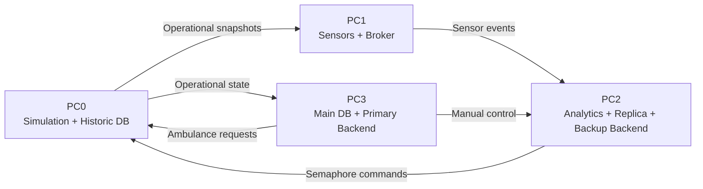

# Smart Semaphore Management

Distributed traffic simulation and smart traffic-light management system for the Distributed Systems course at Pontificia Universidad Javeriana.

| | |
|---|---|
| Team | Daniel Felipe Ramirez Vargas<br>Ana Sofia Arboleda<br>Samuel Pico<br>Guillermo Andres Aponte Cardenas |
| Course | Introduction to Distributed Systems |
| Date | April 2026 |

## Overview

The project models an urban traffic network as a directed graph over a configurable grid. Vehicles enter through border nodes, move through one-way roads, wait at red lights, and leave the system through exit nodes.

The system is split across four logical computers:

- `PC0`: authoritative simulation, vehicle generation, ambulance injection, and historical database.
- `PC1`: simulated sensors and ZeroMQ broker.
- `PC2`: analytics, automatic traffic-light decisions, current-state replica, and backup backend.
- `PC3`: main database, primary backend, manual controls, ambulance requests, and web frontend.

Distributed communication is handled with ZeroMQ. Runtime parameters and all network endpoints are centralized in `config/system_config.json`.



## Repository Layout

```text
PC0/
  simulation/        Authoritative traffic simulation.
  historic_db/       Historical SQLite database for simulation runs.
PC1/
  sensors/           Logical camera, inductive-loop, and GPS sensors.
  broker/            ZeroMQ broker for sensor events.
PC2/
  analytics/         Traffic scoring and semaphore decisions.
  traffic_ctrl/      Semaphore command sender.
  replica_db/        Current-state replica and PC3 resync channel.
  backend_respaldo/  Backup backend for health and current-state queries.
PC3/
  main_db/           Main current-state SQLite database.
  backend/           Primary backend for user operations.
  frontend/          Web UI served by the PC3 backend.
common/
  mensajes/          Shared message contracts.
  modelos/           Domain and simulation models.
  utilidades/        Shared config, logging, persistence, and ZeroMQ helpers.
config/
  system_config.json Central runtime configuration.
scripts/
  start_*.sh         Local and per-PC startup scripts.
```

## Configuration

The main configuration file is `config/system_config.json`. It is loaded with Python's `json.load`, so comments are represented with `_comentario` and `_comentarios` keys instead of native JSON comments.

Main blocks:

- `ciudad`: grid size, road length range, and generation seed.
- `sensores`: active sensor types and publication interval.
- `analitica`: weights used to combine camera, inductive-loop, and GPS measurements.
- `simulacion`: tick duration, simulated clock, vehicle generation, ambulance speed, and snapshot interval.
- `frontend`: PC3 web server host and port.
- `zmq`: every ZeroMQ endpoint used by PC0, PC1, PC2, and PC3.

For local execution, endpoints can stay as `tcp://127.0.0.1:port`. For multiple computers, replace each endpoint host with the IP of the machine that owns that service.

## Traffic Logic

Each observed road has three logical sensors:

- Camera: measures queued vehicles at the end of a road.
- Inductive loop: measures vehicles still moving inside the road.
- GPS: measures average speed of moving vehicles.

PC2 normalizes each measurement to `[0, 1]` and combines them into a road score:

```text
score = camera_weight * camera_note
      + loop_weight * loop_note
      + gps_weight * gps_note
```

Current default weights:

| Sensor | Weight |
|---|---:|
| Camera | 0.50 |
| Inductive loop | 0.35 |
| GPS | 0.15 |

For each intersection, PC2 groups road scores by axis (`HORIZONTAL` or `VERTICAL`) and gives priority to the axis with the higher score. It emits at most one semaphore decision per intersection and simulation tick, avoiding duplicate commands when the phase and timing do not change.

Manual control from PC3 can temporarily force a semaphore phase. While the manual override is active, automatic decisions for that intersection are suspended.

## Persistence and Failover

The project uses SQLite databases generated at runtime:

- `PC0/historic_db/bd_historica.sqlite3`: historical data for later analysis.
- `PC2/replica_db/bd_replicada.sqlite3`: current operational state replica.
- `PC3/main_db/bd_principal.sqlite3`: main current operational state.

PC3 is the primary backend and database owner for user-facing operations. PC2 keeps a current-state replica and exposes a limited backup backend. If PC3 fails:

- PC0 keeps simulating and publishing snapshots.
- PC1 keeps publishing sensor events.
- PC2 keeps analyzing traffic, controlling semaphores, and storing current state.
- PC2 can answer health and current-state queries.
- Creating ambulances and sending new manual controls are disabled until PC3 returns.

When PC3 starts again, it requests the latest snapshot from PC2 and rebuilds its current state before continuing normally.

## Requirements

Use Python 3 and install the project dependencies on every computer that will run a service:

```bash
python3 -m venv .venv
source .venv/bin/activate
python3 -m pip install -r requirements.txt
```

The startup scripts export `PYTHONPATH` automatically. If running modules manually, execute them from the repository root or set:

```bash
export PYTHONPATH="$PWD"
```

## Run Locally

To run every component on one machine, keep the ZeroMQ endpoints in `config/system_config.json` as `127.0.0.1` and run:

```bash
bash scripts/start_localhost.sh
```

The PC3 backend starts the web interface. With the default configuration, it is usually available at:

```text
http://127.0.0.1:8080/
```

To start from clean databases:

```bash
bash scripts/limpiar_bases.sh
```

## Run on Multiple Computers

Each computer must have:

- A copy of the repository.
- The same updated `config/system_config.json`.
- The dependencies from `requirements.txt`.
- Network access to the configured ZeroMQ ports.

The important rule is: each `zmq` endpoint must use the IP of the computer that binds that endpoint.

| Config block | Endpoint | Bound by |
|---|---|---|
| `zmq.pc0` | `ingesta_historica` | `PC0/historic_db` |
| `zmq.pc0` | `entrada_comandos` | `PC0/simulation` |
| `zmq.pc0` | `solicitudes_ambulancia` | `PC0/simulation` |
| `zmq.pc1` | `publicador_sensores` | `PC1/broker` |
| `zmq.pc1` | `salida_broker` | `PC1/broker` |
| `zmq.pc1` | `entrada_estado_operativo` | `PC1/sensors` |
| `zmq.pc2` | `ingesta_replicada` | `PC2/replica_db` |
| `zmq.pc2` | `sincronizacion_estado` | `PC2/replica_db` |
| `zmq.pc2` | `entrada_control_manual` | `PC2/analytics` |
| `zmq.pc2` | `backend_respaldo` | `PC2/backend_respaldo` |
| `zmq.pc3` | `ingesta_principal` | `PC3/main_db` |
| `zmq.pc3` | `backend_principal` | `PC3/backend` |

Example:

| Machine | Example IP |
|---|---|
| PC0 | `192.168.1.10` |
| PC1 | `192.168.1.11` |
| PC2 | `192.168.1.12` |
| PC3 | `192.168.1.13` |

In that setup, every endpoint under `zmq.pc0` should use `192.168.1.10`, every endpoint under `zmq.pc1` should use `192.168.1.11`, and so on.

If the PC3 web interface must be opened from another computer, also update `frontend.pc3.host` to PC3's LAN IP or to `0.0.0.0`. Then open the real PC3 address in the browser, for example:

```text
http://192.168.1.13:8080/
```

Recommended startup order:

```bash
bash scripts/start_pc3.sh
bash scripts/start_pc2.sh
bash scripts/start_pc1.sh
bash scripts/start_pc0.sh
```

Start PC0 last so databases, broker, analytics, and backends are ready before the simulation begins publishing snapshots.

## Common Question

Do I only need to change the IPs in `system_config.json` to run this on different PCs?

Mostly yes. The network configuration is centralized there, so no source-code change should be needed if the same roles and ports are used. In practice, also check:

- All PCs have the same repository version and the same updated config file.
- Dependencies are installed on every PC.
- Firewall rules allow the configured ports, currently `5555` to `5567`.
- The PCs are on the same network or can reach each other through valid routes/VPN.
- `frontend.pc3.host` is adjusted if the UI is accessed from another machine.
- `127.0.0.1` is not used for services that must communicate across different computers.

## Generated Files

Runtime SQLite databases, WAL/SHM files, Python caches, virtual environments, logs, binaries, and build outputs are ignored by `.gitignore`.
